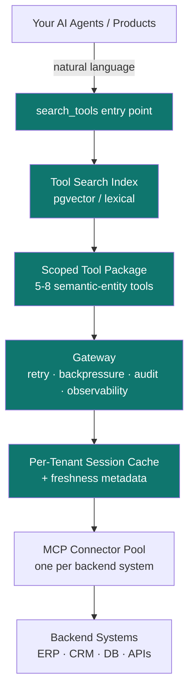

# Progressive Discovery Spine

**An architectural pattern for letting AI agents work against enterprise systems at scale — without context blowout, without hallucinated tool selection, without audit gaps.**

---

## What this is

PDS is a pattern for the layer that sits **between your AI agents and your backend systems**.

Most production AI integrations today expose tools directly to the model — a hundred MCP tools, a thousand database functions, every CRM endpoint. At prototype scale, against one schema with toy data, it works. The moment it hits real enterprise data volumes — millions of records, hundreds of tables, multiple backend systems wired together — it breaks: context window saturates before reasoning begins, the model hallucinates wrong tools, observability is missing, and isolation between data domains is an afterthought.

PDS is the discipline that fixes this. Instead of exposing every backend tool to every agent, the spine:

- Exposes **one entry point** (`search_tools`) that retrieves the right 5–8 tools on demand
- Wraps tools as **semantic business entities**, not raw tables
- Routes every call through a **gateway** with retry, backpressure, observability, audit
- Enforces **tenant isolation** at the protocol layer, not the application layer
- Annotates each tool with **SLA metadata** so agent planners can route intelligently

The result: the same architecture serves a single-schema prototype and a multi-system enterprise deployment handling millions of records across hundreds of tools — whether the integration target is your own internal data estate or a customer's or supplier's. No re-platforming.

## Why it exists

In April 2026, David Soria Parra (co-creator of MCP at Anthropic) used his keynote at MCP Dev Summit NA to publicly document what breaks when enterprises scale MCP naively. His four failure modes:

1. **Context bloat** — dozens to hundreds of tools exposed upfront; >20% of the context window consumed before reasoning starts
2. **Hallucinated tool selection** — with unlimited tool choice, models pick wrong tools
3. **Production gaps** — the protocol itself defines no retries, observability, backpressure, or coordination between agents
4. **Discovery anti-patterns** — static tool exposure fails at scale; dynamic retrieval (progressive discovery) is the emerging pattern

> "Across dozens of integrations, a significant portion of the context window is consumed before the model does any actual reasoning. Teams blame MCP when the issue is implementation."
>
> — David Soria Parra, co-creator of MCP · Anthropic · MCP Dev Summit NA 2026

PDS is the implementation pattern that addresses all four. It's what production teams converge on after their second or third real customer.

## Architecture

Every arrow through PDS is observable, tenant-scoped, retry-handled, and audit-logged.

## The 10 principles

| # | Principle | The shift |
|---|---|---|
| 01 | **Semantic entity tools, not table tools** | The tool *is* the business query (`search_open_pos`), not a primitive (`po_header`). Composition lives in the tool, not the agent. |
| 02 | **Workflow-scoped tool packages** | Load 5–8 tools per agent task, not 200. Each agent declares its pack at session start. |
| 03 | **Tool search as the default entry point** | One meta-tool (`search_tools`) stays loaded. Agent asks in plain English; PDS retrieves the right five. |
| 04 | **Normalized data model as abstraction** | Agent reasons on `Supplier` / `PurchaseOrder` / `Invoice`, not on `LIFNR` or `PO_HEADERS_ALL`. Connectors translate. |
| 05 | **Gateway as the control layer** | Retry, backpressure, circuit breaker, tenant isolation, schema validation — none of these are in MCP itself. Put them in the spine. |
| 06 | **Per-session caching with freshness metadata** | Cache by `(tenant, session, tool, params)`. Every response carries `fetched_at` + `cache_age_seconds` + `freshness_policy` so agents decide when to bypass. |
| 07 | **Tenant-scoped tool catalogs** | An Oracle-tenant session only sees Oracle-backed tools. SAP-tenant sees SAP-backed. Smaller context, zero collisions, no cross-tenant leak surface. |
| 08 | **Failure-aware tool descriptions** | Every tool description includes p50/p95 latency, freshness, batch windows, known failure modes. Agent planners route around degradation. |
| 09 | **Action menu = curated invocation** | UI surfaces a small set of pre-parameterized actions per entity. Parameters bound from UI context, not generated by the agent. Zero hallucination surface. |
| 10 | **Natural-language entry as the front door** | Replace 200 tools with one text box. The spine resolves the rest. |

Full discussion of each principle, with problems, patterns, and implementation notes, lives in [SPEC.md](SPEC.md).

## What good looks like (target SLAs)

| Metric | Target | Why it matters |
|---|---|---|
| Context used by tool definitions | < 5% of window | The point of progressive discovery |
| Cache hit rate per session | > 60% | Cache earns its keep |
| Tool invocation p95 latency (live) | < 2,000 ms | Most enterprise systems clear this |
| Tool invocation p50 latency (cached) | < 50 ms | Cache must be lightweight |
| Cross-tenant leakage incidents | 0 | Non-negotiable |
| Audit log completeness | 100% | SOC 2 Type II prerequisite |
| Tools available per tenant (via search) | > 200 | Coverage |
| Tools loaded into agent context by default | 5–8 | Efficiency |

## Reference build sequence

PDS is an eight-week build from skeleton to first production reference deployment:

| Week | Deliverable |
|---|---|
| 1 | Tool manifest format · `search_tools` over pgvector · basic gateway with retry/backoff |
| 2 | First connector exposed through PDS with 3–5 semantic tools · end-to-end trace |
| 3 | Per-tenant session cache · audit log · first internal consumer |
| 4 | Workflow-scoped packages · second and third agent consumers |
| 5 | Second connector (different backend), proving cross-system semantic-tool abstraction |
| 6 | SLA metadata · failure-mode descriptions · circuit breaker · production-ready |
| 7 | First end-to-end production reference deployment |
| 8 | Spec / one-pager / investor materials |

See [SPEC.md](SPEC.md#build-sequence) for details.

## Who this is for

- **Enterprise platform teams** wiring AI agents into their own ERP / CRM / data warehouse / lakehouse — when the prototype that worked on one schema chokes on the full production catalog
- **B2B integration teams** building agent-driven workflows across customer or supplier data — when one connector becomes ten and tool catalogs explode
- **Enterprise architects and CTOs** evaluating MCP for production rollout — this is the missing layer above the protocol
- **AI engineers** building agent systems against high-volume enterprise data — the discipline that keeps agents coherent at 100+ tools and millions of records
- **Buyers** of AI vendors — the questions to ask vendors who claim to scale ("Do you progressively discover tools? Is there a gateway? Where's tenant isolation enforced?")

## What this is not

- Not a library you install. It's an architectural pattern with reference SLAs and examples.
- Not a replacement for MCP. It sits **on top of** MCP and fills the gaps the protocol leaves open.
- Not vendor-specific. The pattern applies whether your backends are ERP, CRM, custom APIs, internal databases, or all of the above.

## Examples

The [`examples/`](examples/) directory has concrete artifacts:

- [`tool-manifest.example.json`](examples/tool-manifest.example.json) — what a semantic-entity tool looks like with full SLA metadata
- [`search-tools-sketch.py`](examples/search-tools-sketch.py) — minimal sketch of how `search_tools` retrieval works
- [`action-menu.md`](examples/action-menu.md) — UI pattern for curated invocation (principle #9)

## Citing this work

If you reference PDS in a paper, talk, blog post, or vendor architecture, please cite it. A machine-readable citation file is in [CITATION.cff](CITATION.cff). Suggested citation:

> Mattie, D. (2026). *Progressive Discovery Spine: An architectural pattern for scaling AI agents against enterprise systems.* https://github.com/drewmattie-code/pds

## Contributing

Issues, examples, implementation reports, and connector patterns welcome. See [CONTRIBUTING.md](CONTRIBUTING.md).

## License

- **Spec, documentation, diagrams** — [Creative Commons Attribution 4.0 (CC BY 4.0)](LICENSE-CC-BY-4.0). Use it, adapt it, build commercial products on top — credit the source.
- **Code samples and examples** — [MIT](LICENSE-MIT).

See [LICENSE](LICENSE) for the summary.

## Author

[Drew Mattie](https://www.linkedin.com/in/drew-mattie-88084826/) · Charles & Roe Inc. · 2026
