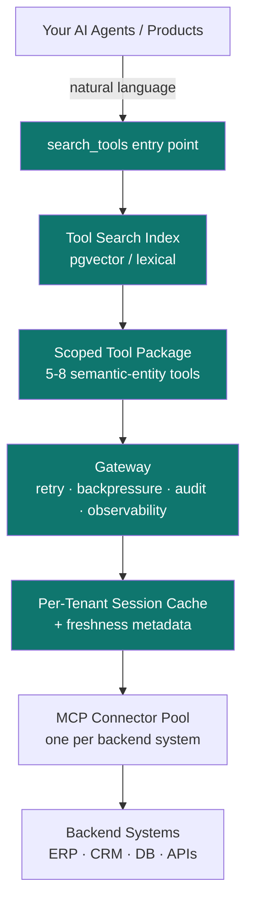

<div align="center">

# Progressive Discovery Spine

**The missing architectural layer above MCP. Production patterns for LLM agents wired to enterprise systems at scale, without context blowout, hallucinated tool selection, or audit gaps.**

[](LICENSE-CC-BY-4.0)
[](LICENSE-MIT)
[](SPEC.md)
[](dist/skills/pds/SKILL.md)

</div>

---

## What this is

PDS is a pattern for the layer that sits **between your AI agents and your backend systems**.

Most production AI integrations today expose tools directly to the model: a hundred MCP tools, a thousand database functions, every CRM endpoint. At prototype scale, against one schema with toy data, it works. The moment it hits real enterprise data volumes (millions of records, hundreds of tables, multiple backend systems wired together) it breaks: context window saturates before reasoning begins, the model hallucinates wrong tools, observability is missing, and isolation between data domains is an afterthought.

PDS is the discipline that fixes this. Instead of exposing every backend tool to every agent, the spine:

- Exposes **one entry point** (`search_tools`) that retrieves the right 5-8 tools on demand
- Wraps tools as **semantic business entities**, not raw tables
- Routes every call through a **gateway** with retry, backpressure, observability, audit
- Enforces **tenant isolation** at the protocol layer, not the application layer
- Annotates each tool with **SLA metadata** so agent planners can route intelligently

The result: the same architecture serves a single-schema prototype and a multi-system enterprise deployment handling millions of records across hundreds of tools, whether the integration target is your own internal data estate or a customer's or supplier's. No re-platforming.

## Why it exists

In April 2026, David Soria Parra (co-creator of MCP at Anthropic) used his MCP Dev Summit NA keynote to publicly document the failure modes that recur when enterprises deploy MCP naively. His characterization across the talk and subsequent interviews can be summarized as four problems:

1. **Context bloat**: dozens to hundreds of tools exposed upfront; a significant portion of the context window consumed by tool definitions before reasoning starts
2. **Hallucinated tool selection**: with unlimited tool choice, models pick wrong tools
3. **Production gaps**: the protocol itself defines no retries, observability, backpressure, or coordination between agents
4. **Discovery anti-patterns**: static tool exposure fails at scale; dynamic retrieval (progressive discovery) is the emerging pattern

Soria Parra's root framing, that the protocol isn't broken but the deployment pattern around it is, is the claim PDS builds on. PDS is the implementation pattern that addresses all four failure modes. It's what production teams converge on once they hit their second or third real backend system.

References: [Soria Parra's MCP Dev Summit keynote](https://youtu.be/v3Fr2JR47KA) · [Shiftmag interview with the MCP co-creator](https://shiftmag.dev/mcp-co-creator-explains-why-mcp-needs-more-than-the-protocol-to-scale-9041/)

## Architecture



Every arrow through PDS is observable, tenant-scoped, retry-handled, and audit-logged.

## Where PDS fits in the MCP stack

The Model Context Protocol (MCP) gave the industry a clean, vendor-neutral way to expose tools to AI models. As a protocol, it works. As a *deployment pattern*, it leaves four production gaps that every team scaling MCP naively rediscovers: context bloat, hallucinated tool selection, missing production controls (retries / observability / backpressure / audit), and discovery anti-patterns.

PDS is the layer that closes those gaps. It does not replace MCP, it sits **on top of MCP** and treats MCP servers as the substrate:

```
┌────────────────────────────────────────┐
│ AI Agents · LLM Products · Copilots    │  ← what your users see
└──────────────────┬─────────────────────┘
                   ↓
┌────────────────────────────────────────┐
│ Progressive Discovery Spine (PDS)      │  ← THIS spec
│ tool search · packs · gateway · cache  │
│ tenant isolation · audit · SLA-aware   │
└──────────────────┬─────────────────────┘
                   ↓
┌────────────────────────────────────────┐
│ Model Context Protocol (MCP)           │  ← Anthropic's protocol
│ one MCP server per backend             │
└──────────────────┬─────────────────────┘
                   ↓
┌────────────────────────────────────────┐
│ Enterprise systems · ERP · CRM · DBs   │  ← your data
└────────────────────────────────────────┘
```

If MCP is HTTP for AI-to-data, PDS is the load balancer, auth proxy, and traffic shaper that production HTTP deployments take for granted. MCP is necessary; PDS is what lets MCP survive past prototype.

## The 10 principles

| # | Principle | The shift |
|---|---|---|
| 01 | **Semantic entity tools, not table tools** | The tool *is* the business query (`search_open_pos`), not a primitive (`po_header`). Composition lives in the tool, not the agent. |
| 02 | **Workflow-scoped tool packages** | Load 5-8 tools per agent task, not 200. Each agent declares its pack at session start. |
| 03 | **Tool search as the default entry point** | One meta-tool (`search_tools`) stays loaded. Agent asks in plain English; PDS retrieves the right five. |
| 04 | **Normalized data model as abstraction** | Agent reasons on `Supplier` / `PurchaseOrder` / `Invoice`, not on `LIFNR` or `PO_HEADERS_ALL`. Connectors translate. |
| 05 | **Gateway as the control layer** | Retry, backpressure, circuit breaker, tenant isolation, schema validation, none of these are in MCP itself. Put them in the spine. |
| 06 | **Per-session caching with freshness metadata** | Cache by `(tenant, session, tool, params)`. Every response carries `fetched_at` + `cache_age_seconds` + `freshness_policy` so agents decide when to bypass. |
| 07 | **Tenant-scoped tool catalogs** | An Oracle-tenant session only sees Oracle-backed tools. SAP-tenant sees SAP-backed. Smaller context, zero collisions, no cross-tenant leak surface. |
| 08 | **Failure-aware tool descriptions** | Every tool description includes p50/p95 latency, freshness, batch windows, known failure modes. Agent planners route around degradation. |
| 09 | **Action menu = curated invocation** | UI surfaces a small set of pre-parameterized actions per entity. Parameters bound from UI context, not generated by the agent. Zero hallucination surface. |
| 10 | **Natural-language entry as the front door** | Replace 200 tools with one text box. The spine resolves the rest. |

Full discussion of each principle, with problems, patterns, and implementation notes, lives in [SPEC.md](SPEC.md).

## Industry context: convergence on the same pattern

PDS is not a novel invention. It's a formalization of a pattern that production AI teams have independently converged on across the industry. Major companies, infrastructure vendors, and published whitepapers in late 2025 and early 2026 have all arrived at the same conclusion: MCP at enterprise scale requires a layer above the protocol that progressively discovers tools rather than statically exposing them. PDS synthesizes that convergence into a single referenceable specification.

### Independent industry implementations

**Amazon (Prime Video): Progressive Tool Discovery for MCP Servers.** Amazon's Prime Video team documented their own implementation in the ZenML LLMOps Database. Their description matches PDS principles #2 and #3 directly: "exposing only a single 'find tools' capability at initialization that agents could invoke to dynamically discover and load relevant tool subsets based on problem categories." Reported result: from hundreds of tools to just three or four context-appropriate tools per task. [Source](https://www.zenml.io/llmops-database/progressive-tool-discovery-for-mcp-servers-to-manage-context-at-scale)

**Speakeasy: 100x token reduction with dynamic toolsets.** Speakeasy benchmarked the static-vs-dynamic-discovery tradeoff concretely: "A general purpose MCP server for a large enterprise product with hundreds of tools consumes 405,000 tokens before any work begins. Since Claude's context window is 200,000 tokens, this server simply won't work." Their dynamic-discovery system reduces token usage by 100x or more while maintaining performance as toolset size grows. [100x reduction post](https://www.speakeasy.com/blog/100x-token-reduction-dynamic-toolsets) · [Progressive discovery vs semantic search comparison](https://www.speakeasy.com/blog/how-we-reduced-token-usage-by-100x-dynamic-toolsets-v2)

**TrueFoundry: MCP Gateway as a commercial product.** TrueFoundry shipped an MCP Gateway whose architecture matches PDS principles #5 (gateway as control layer) and #7 (tenant-scoped catalogs): "agents do not discover tools by directly querying MCP servers or relying on static configuration. Instead, tool discovery is mediated through the MCP Gateway, which sits between agents and MCP servers and enforces discovery using identity, environment, and policy context." [MCP Gateway product](https://www.truefoundry.com/mcp-gateway) · [Tool discovery deep-dive](https://www.truefoundry.com/blog/mcp-tool-discovery-for-enterprise-ai-agents)

**Matthew Kruczek: "Progressive Disclosure MCP" whitepaper (January 2026).** Kruczek formalized the pattern with measured benchmarks: "Production implementations report 85-100x reductions in token usage while maintaining or improving tool selection accuracy." His central claim aligns with PDS's framing: "Every major implementation pushing MCP to enterprise scale has independently converged on progressive disclosure as the solution." [Whitepaper](https://matthewkruczek.ai/blog/progressive-disclosure-mcp-servers.html)

**Anthropic: Knowledge Work Plugins marketplace.** Anthropic ships PDS-pattern plugins as their canonical productized form. Each plugin is a workflow-scoped pack (PDS principle #2) bundling skills (#3), MCP connectors (#7), and slash commands (#9). "Every plugin follows the same structure: skills, commands, connectors, every component is file-based (markdown and JSON), no code, no infrastructure, no build steps." Cowork ([claude.com/product/cowork](https://claude.com/product/cowork)) is the buyer-facing surface; the plugin format is shared with Claude Code. [Source](https://github.com/anthropics/knowledge-work-plugins)

**Claude-Mem: persistent memory with explicit Progressive Disclosure philosophy.** Open-source Claude Code memory system (~v6.5.0, Apache 2.0) whose published architecture page is titled "Progressive Disclosure": "MCP search tools follow a token-efficient 3-layer workflow, search (compact index with IDs), timeline (chronological context), get_observations (full details only for filtered IDs)." The author reports ~10x token savings by filtering before fetching. This is PDS principle #3 applied to memory artifacts rather than enterprise tools, and the same vocabulary. [Source](https://github.com/thedotmack/claude-mem) · [Philosophy page](https://docs.claude-mem.ai/progressive-disclosure)

**Nango: pre-MCP gateway pattern at production scale.** Open-source integration platform (Elastic License v2) used in production by Replit, Ramp, Mercor, and hundreds of others. Its three primitives (Auth, Proxy, Functions) map 1:1 to PDS principles #5 (gateway as control layer) and #1 (semantic-entity tools): "The runtime provides per-tenant isolation, elastic scaling, automatic retries, and rate-limit handling." Nango solved the same architectural problem PDS describes before MCP existed, with their own protocol. Their billions-of-API-requests scale is market validation that the gateway pattern works at production. [Source](https://github.com/NangoHQ/nango)

**Microsoft: Agent Governance Toolkit.** Microsoft's MIT-licensed governance kernel for autonomous AI agents, multi-language (Python/TS/.NET/Rust/Go), covering OWASP Agentic Top 10 10/10. Productizes PDS principle #5 (gateway as control layer) with deterministic policy denial, SPIFFE/DID/mTLS identity, and tamper-evident audit: "Actions the AGT kernel denies are not 'unlikely.' They are structurally impossible." Microsoft anchors the empirical case in JailbreakBench (Chao et al., NeurIPS 2024), where adaptive attacks reach near-100% ASR on frontier safety-aligned models, concluding that prompt-layer defenses leak double-digit residual ASR and deterministic enforcement is the only viable substrate. [Source](https://github.com/microsoft/agent-governance-toolkit)

**Composio: productized PDS at scale.** Commercial integration platform with 1000+ pre-integrated tools, explicit tool-search API, per-toolkit auth, context management, and a sandboxed workbench. Maps tightly to PDS principle #3 (tool search as default entry point) productized as a public API, and principle #7 (gateway as control layer) productized as auth-per-toolkit. The closest competitor to the architectural pattern PDS describes; citing it positions PDS as the portable open spec vs Composio's productized commercial stack. [Source](https://github.com/ComposioHQ/composio)

**MuleSoft Agent Fabric (Salesforce).** The Agent Registry (built on Anypoint Exchange) is a centralized, continuously-scanned catalog for discovering agents, MCP servers, and AI assets, and an MCP Bridge exposes existing APIs as agent-usable tools. A major-vendor productization of PDS-style progressive discovery and tool-surface exposure. [Source](https://www.mulesoft.com/ai/agent-fabric)

**UiPath (Integration Service + activity library).** A large, governed connector and tool catalog agents draw on inside an enterprise automation platform. The curated tool surface PDS specifies the progressive-discovery discipline for. [Source](https://www.uipath.com/platform/agentic-automation)

### Harness-engineering convergence: progressive disclosure as Pattern #1

The agent-harness field independently named "progressive disclosure" as the first repeating design pattern of every serious harness. This is PDS's exact thesis, almost the exact term.

**SWE-agent: Agent-Computer Interfaces (Princeton NLP).** A purpose-built tool interface, capped search results, stateful line-numbered viewers, stale-observation summarization, produced a 64% relative improvement over a raw shell with the same model on the same task. The empirical case that PDS principle #3 (scoped/capped tool surfaces over raw access) is load-bearing, not cosmetic. [arXiv:2405.15793](https://arxiv.org/abs/2405.15793)

**OpenAI: Harness Engineering.** OpenAI's agent-first development model uses a short (~100-line) `AGENTS.md` as a map pointing to a structured `docs/` system of record, calling the technique progressive disclosure: "agents start with a small, stable entry point and are taught where to look next, rather than being overwhelmed upfront." PDS's per-task tool scoping is the same economics on the tool axis. [Source](https://openai.com/index/harness-engineering/)

**Harness-engineering synthesis.** The cross-team synthesis of agent-harness practice names progressive disclosure as the first repeating design pattern across SWE-agent, Anthropic's Claude Code harness, and OpenAI's Codex harness, the same minimum-context-plus-pointers economics PDS specifies for the tool surface. Its thesis (execution is a commodity; the moat is the environment and harness) is the Spine thesis.

**Garry Tan: skill packs as the unit of agentic capability.** A widely-read essay argues the artifact is no longer lines of code but the skill pack: a tested, reusable markdown skill plus minimal code, a unit test, an LLM eval, an integration test, and a resolver that auto-invokes the skill when relevant. The skill pack and the harness are named as the new systems primitives of agentic engineering, PDS's progressive-discovery-of-capabilities thesis carried to the packaging-and-resolution layer, with tests and evals as the discipline that separates it from vibe coding.

### Foundational sources from protocol authors

**Anthropic: Agent Skills design principle.** Anthropic's own Agent Skills design uses progressive discovery as the core architectural principle: skills load metadata first, full instructions on demand, supplementary files only when needed. The mechanism is identical to PDS principle #3 (tool search as default entry point), applied to skills instead of MCP tools. [Agent Skills overview](https://platform.claude.com/docs/en/agents-and-tools/agent-skills/overview) · [Anthropic engineering blog: Equipping agents for the real world with Agent Skills](https://www.anthropic.com/engineering/equipping-agents-for-the-real-world-with-agent-skills)

**David Soria Parra (MCP co-creator): MCP Dev Summit NA 2026 keynote.** Soria Parra publicly documented the four failure modes PDS addresses. [Keynote](https://youtu.be/v3Fr2JR47KA) · [Shiftmag interview](https://shiftmag.dev/mcp-co-creator-explains-why-mcp-needs-more-than-the-protocol-to-scale-9041/)

**OpenAI: function calling documentation.** OpenAI's official function-calling guide explicitly recommends tool search for large tool sets: "When your application has many functions or large schemas, you can pair function calling with tool search to defer rarely used tools and load them only when the model needs them." This is PDS principle #3 in OpenAI's own words. [OpenAI function calling guide](https://developers.openai.com/api/docs/guides/function-calling)

**LangChain: dynamic tool calling in LangGraph.** LangChain added dynamic tool calling as a core LangGraph feature: "you can now control which tools are available at different points in a run... start with a small, focused toolset, then expand as the task evolves." [LangChain changelog announcement](https://changelog.langchain.com/announcements/dynamic-tool-calling-in-langgraph-agents)

**Model Context Protocol specification.** The protocol PDS sits above. [modelcontextprotocol.io](https://modelcontextprotocol.io)

**modelcontextprotocol/servers: the canonical MCP server registry.** The reference catalog of MCP servers maintained by the protocol authors (Anthropic-led, multi-vendor contributions). PDS's progressive-discovery semantics presuppose an MCP server ecosystem to expose the discoverable surface; this is that ecosystem's center of gravity. At 86k+ stars it is the de facto registry every PDS-compliant implementation routes through. [Source](https://github.com/modelcontextprotocol/servers)

### What PDS contributes

The sources above document INDIVIDUAL implementations and isolated principles. PDS contributes:

1. A unified set of **10 principles** mapped to specific documented failure modes
2. **Target SLAs** for production readiness
3. An **8-step build sequence** from skeleton to reference deployment
4. **Anti-patterns** to avoid
5. A **portable, citable specification** under CC BY 4.0: adopt, adapt, build commercial products on top, with attribution

If your team is independently converging on this pattern (as Amazon, Speakeasy, TrueFoundry, and others already have), PDS gives you a vocabulary, a checklist, and a published artifact you can hand to your peers.

## The Spine catalog

PDS is one spec in a catalog of eight, each naming a distinct architectural concern in production agentic systems. The catalog lets you attribute a failure to the layer that owns it rather than blaming "the AI."

| Spec | Concern | Status |
|---|---|---|
| **PDS** Progressive Discovery Spine | Tool discovery | Public |
| **ACS** Adversarial Coordination Spine | Multi-agent coordination | Public |
| **ESF** External Signal Fabric | External-world signals | Public |
| **CRI** Composite Risk Index | Composite risk scoring | Private (patent-preservation) |
| **AGS** Agent Governance Spine | Deterministic governance, identity, audit | Public |
| **DCS** Durable Context Spine | Durable state and memory across sessions and time | Public |
| **GDS** Grounded Data Spine | A canonical semantic model (text-to-metric) plus data-level entitlements | Private (forthcoming) |
| **ARS** Agent Registry Spine | The inventory substrate: one system of record for every agentic asset that discovery reads from and governance enforces against | Private (forthcoming) |

**Where PDS sits relative to DCS.** PDS scopes tools per task; DCS scopes durable knowledge per session. The two are the discovery and persistence halves of the same context-economy discipline.

**Nine-way failure attribution.** When an agent system misbehaves, the catalog tells you which layer to fix:

| Symptom | Owning layer |
|---|---|
| Bad customer / tool data | PDS |
| Bad world data | ESF |
| Bad reasoning | ACS Planner |
| Bad evaluation | ACS Evaluator |
| Bad scoring | CRI |
| Bad governance | AGS |
| Bad continuity | DCS |
| Bad grounding | GDS |
| Bad or missing registry | ARS |

## What good looks like (target SLAs)

| Metric | Target | Why it matters |
|---|---|---|
| Context used by tool definitions | < 5% of window | The point of progressive discovery |
| Cache hit rate per session | > 60% | Cache earns its keep |
| Tool invocation p95 latency (live) | < 2,000 ms | Most enterprise systems clear this |
| Tool invocation p50 latency (cached) | < 50 ms | Cache must be lightweight |
| Cross-tenant leakage incidents | 0 | Non-negotiable |
| Audit log completeness | 100% | SOC 2 Type II prerequisite |
| Tools available per tenant (via search) | > 200 | Coverage |
| Tools loaded into agent context by default | 5-8 | Efficiency |

## Reference build sequence

PDS is built in sequence, skeleton through to first production reference deployment. Each step depends on the previous one. Pace varies by team and tooling; the sequence does not.

| Step | Deliverable |
|---|---|
| 1 | Tool manifest format · `search_tools` over pgvector · basic gateway with retry/backoff |
| 2 | First connector exposed through PDS with 3-5 semantic tools · end-to-end trace |
| 3 | Per-tenant session cache · audit log · first internal consumer |
| 4 | Workflow-scoped packages · second and third agent consumers |
| 5 | Second connector (different backend), proving cross-system semantic-tool abstraction |
| 6 | SLA metadata · failure-mode descriptions · circuit breaker · production-ready |
| 7 | First end-to-end production reference deployment |
| 8 | Spec / one-pager / case study |

See [SPEC.md](SPEC.md#build-sequence) for details.

## Who this is for

- **Enterprise platform teams** wiring AI agents into their own ERP / CRM / data warehouse / lakehouse, when the prototype that worked on one schema chokes on the full production catalog
- **B2B integration teams** building agent-driven workflows across customer or supplier data, when one connector becomes ten and tool catalogs explode
- **Enterprise architects and CTOs** evaluating MCP for production rollout, this is the missing layer above the protocol
- **AI engineers** building agent systems against high-volume enterprise data, the discipline that keeps agents coherent at 100+ tools and millions of records
- **Buyers** of AI vendors, the questions to ask vendors who claim to scale ("Do you progressively discover tools? Is there a gateway? Where's tenant isolation enforced?")

## What this is not

- Not a library you install. It's an architectural pattern with reference SLAs and examples.
- Not a replacement for MCP. It sits **on top of** MCP and fills the gaps the protocol leaves open.
- Not vendor-specific. The pattern applies whether your backends are ERP, CRM, custom APIs, internal databases, or all of the above.

## Use it with Claude (or any AI coding agent)

PDS ships with a [Claude Code skill](dist/skills/pds/SKILL.md) that turns the spec into an active architectural consultant inside your AI coding session. Install:

```bash
mkdir -p ~/.claude/skills/pds
curl -fsSL https://raw.githubusercontent.com/drewmattie-code/Progressive-Discovery-Spine/main/dist/skills/pds/SKILL.md \
  -o ~/.claude/skills/pds/SKILL.md
```

After install, the skill auto-activates whenever you ask Claude about MCP at scale, tool catalog management, agent-to-enterprise integration, or any of the other triggering contexts. It diagnoses which of the four documented failure modes you're hitting and recommends which of the 10 principles to apply.

Works in Claude Code natively. The SKILL.md format is portable. Drop it into Cursor, Codex, or any agent that supports the convention. See [`dist/skills/README.md`](dist/skills/README.md) for client-specific install paths.

## Examples

The [`examples/`](examples/) directory has concrete artifacts:

- [`tool-manifest.example.json`](examples/tool-manifest.example.json): what a semantic-entity tool looks like with full SLA metadata
- [`search-tools-sketch.py`](examples/search-tools-sketch.py): minimal sketch of how `search_tools` retrieval works
- [`action-menu.md`](examples/action-menu.md): UI pattern for curated invocation (principle #9)

## Citing this work

If you reference PDS in a paper, talk, blog post, or vendor architecture, please cite it. A machine-readable citation file is in [CITATION.cff](CITATION.cff). Suggested citation:

> Mattie, D. (2026). *Progressive Discovery Spine: An architectural pattern for scaling AI agents against enterprise systems.* https://github.com/drewmattie-code/Progressive-Discovery-Spine

## Contributing

Issues, examples, implementation reports, and connector patterns welcome. See [CONTRIBUTING.md](CONTRIBUTING.md).

## License

- **Spec, documentation, diagrams**: [Creative Commons Attribution 4.0 (CC BY 4.0)](LICENSE-CC-BY-4.0). Use it, adapt it, build commercial products on top. Credit the source.
- **Code samples and examples**: [MIT](LICENSE-MIT).

See [LICENSE](LICENSE) for the summary.

## Author

[Drew Mattie](https://www.linkedin.com/in/drew-mattie-88084826/) · SaaSquach AI Labs (a division of Charles & Roe Inc.) · 2026
